# dmg-acid2
dmg-acid2 is a test for developers of Game Boy (DMG) emulators to verify their
emulation of the Game Boy's Pixel Processing Unit (PPU).

[Download the ROM](https://github.com/mattcurrie/dmg-acid2/releases/download/v1.0/dmg-acid2.gb),
or build using [RGBDS](https://github.com/rednex/rgbds):

```
git clone --recurse-submodules https://github.com/mattcurrie/dmg-acid2
cd dmg-acid2 && make
```

For testing the Game Boy Color you can try [cgb-acid2](https://github.com/mattcurrie/cgb-acid2).

## Reference Image
An accurate DMG emulator should generate output identical to the image below:


An accurate CGB emulator running in DMG mode should generate output identical
to the image below:

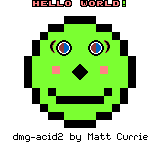

A DMG emulator should use these 8-bit values in greyscale images or in RGB
components to ensure the images can be compared correctly: 
`$00`, `$55`, `$AA`, `$FF`.

When emulating a CGB running in DMG mode, you should use this formula to
convert each 5-bit CGB palette component to 8-bit: 
`(r << 3) | (r >> 2)`

* [Reference photo from DMG](https://github.com/mattcurrie/dmg-acid2/raw/master/img/photo-dmg.jpg) 
* [Reference photo from CGB](https://github.com/mattcurrie/dmg-acid2/raw/master/img/photo-cgb.jpg)

## Emulator Requirements
A simple line based renderer is sufficient to generate the correct output. This
is NOT a [PPU timing torture test requiring T-cycle accuracy](https://github.com/mattcurrie/mealybug-tearoom-tests),
and does NOT perform register writes during the PPU's mode 3.

The test uses LY=LYC coincidence interrupts to perform register writes on
specific rows of the screen during mode 2 (OAM scan).

## Guide

### Hello World!
The "Hello World" text is constructed from 10 objects, and the exclaimation
mark is part of the background. There is also an additional solid white object
where the exclaimation mark is. Due to the 10 object per line limit, the solid
white object should not be drawn, allowing the background to show through.

### Hair
The mohawk hair is not visible in the reference image. The hair tiles are 
part of the background. For rows 8-15, bit 0 of LCDC is reset, so the
background should not be displayed, and instead color 0 from BGP should be
drawn on the screen.

### Eyes
The eyes consist of four background/window tiles, and objects overlapping color
0 background pixels.

The left eye is drawn using the background, and the right eye is drawn using
the window (and also the right edge of the head beside the right eye). At the
bottom of the eye, the WX register is set to an off-screen value, so the window
is hidden until the WX register is set again for drawing the right side of the
chin.

The background/window tiles for the left half of both eyes have color 0 for the
pupil region of the eye. There are two dark grey colored objects that overlap
the left half of both eyes that have the OBJ-to-BG Priority (bit 7) set in the
OAM flags, so the object will only show through color 0 of the background/
window tile and replaces the white color.

The top half of each eye uses tile data from the $8000-8fff region of VRAM. The
bottom half of each eye uses tile data from the $8800-97ff region of VRAM. 
The bottom half of the eye uses tiles with index $a1 and $a2 to test that
signed tile indexes are displayed correctly.

### Moles
The moles are not visible in the reference image, but can be seen in the
failure case images.

The mole beside the left eye is visible if the background tile data is read 
from $8000-8fff instead of $8800-97ff.

The mole left of the nose is not visible because a blank object with a lower
X-coordinate has priority, even though it is defined later in OAM than the mole
object.

The mole right of the nose is not visible because a blank object at the same X
coordinate has priority because it occurs earlier in OAM than the mole object.

### Nose
The nose consists of four objects using the same tile data that is flipped
vertically and/or horizontally. The top left corner of the nose contains the
unflipped tile.

### Mouth
The mouth consists of eight 8x16 objects. The left and right edges of the mouth
contain unflipped tile data, and other objects use vertically flipped tile
data.

For the left side of the mouth, the objects specify tile index 12, and the right
side of the mouth specify tile index 13. Because bit 0 of the tile index is
ignored for 8x16 objects, the whole mouth effectively uses tile index 12.

### Chin
The right side of the chin is drawn using the window. After the right eye was
drawn, the window was hidden by setting WX to an off-screen value. For the
right side of the chin, the WX value is restored to an on-screen value. After
the chin has been drawn, the window is disabled using bit 5 of the LCDC
register so the window does not cover the footer text.

For the right side of the chin, the window has been updated to use the tile map
from the VRAM beginning at $9800.  Because 16 rows of window have already been
drawn for the eye, the right side of the chin is rendered starting from address
$9840.

### Footer Text
For the footer text, the background is set to use the $9c00-9fff region for
the map data, and tile data is set to come from the $8800-97ff region.

## Failure Examples
See the table below for some examples of incorrect behaviour and the
corresponding attribute/flag. This is not intended to be an exhaustive list of
all possible failures.

| Failure Example | Failure Description | Functionality Tested |
| --------------- | ------------------- | -------------------- |
| 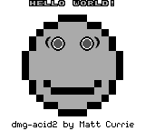 | Nose missing | Object Palette (bit 4) |
| 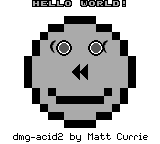 | Nose tiles flipped, right eyelash flipped | Object Horizontal Flip (bit 5) |
| 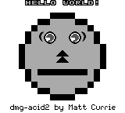 | Nose tiles filpped, mouth straight, eye whites bottom left wrong | Object Vertical Flip (bit 6) |
| 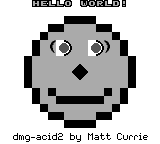 | Eye whites left half wrong | Object to Background Priority (bit 7) |
| 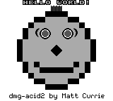 | Hair visible | Background Enable (bit 0) |
| 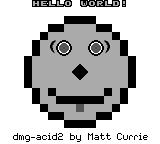 | Tongue visible | Object Enable (bit 1) |
| 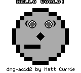 | Half of mouth missing | Object Size (bit 2) |
| 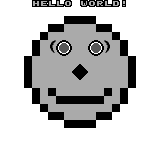 | Footer missing | Background Tile Map (bit 3) |
|  | Eye whites top left quadrant wrong | Background/Window Tile Data (bit 4) |
|  | Half of footer missing | Window Enable (bit 5) |
| 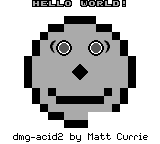 | Right chin missing | Window Tile Map (bit 6) |
| 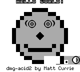 | Eye displayed instead of right chin | Window internal line counter |
|  | Left mole visible | Object Priority Lower X Coordinate |
|  | Right mole visible | Object Priority Same X Coordinate |
| 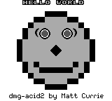 | Hello World missing exclaimation mark (!) | 10 object per line limit |
| 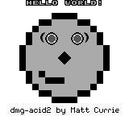 | Half of mouth missing | Bit 0 of tile index for 8x16 objects should be ignored |

## Credits
Håkon Wium Lie and Ian Hickson for creation of the original 
[Acid2](http://www.acidtests.org/) web standards compliance test.
